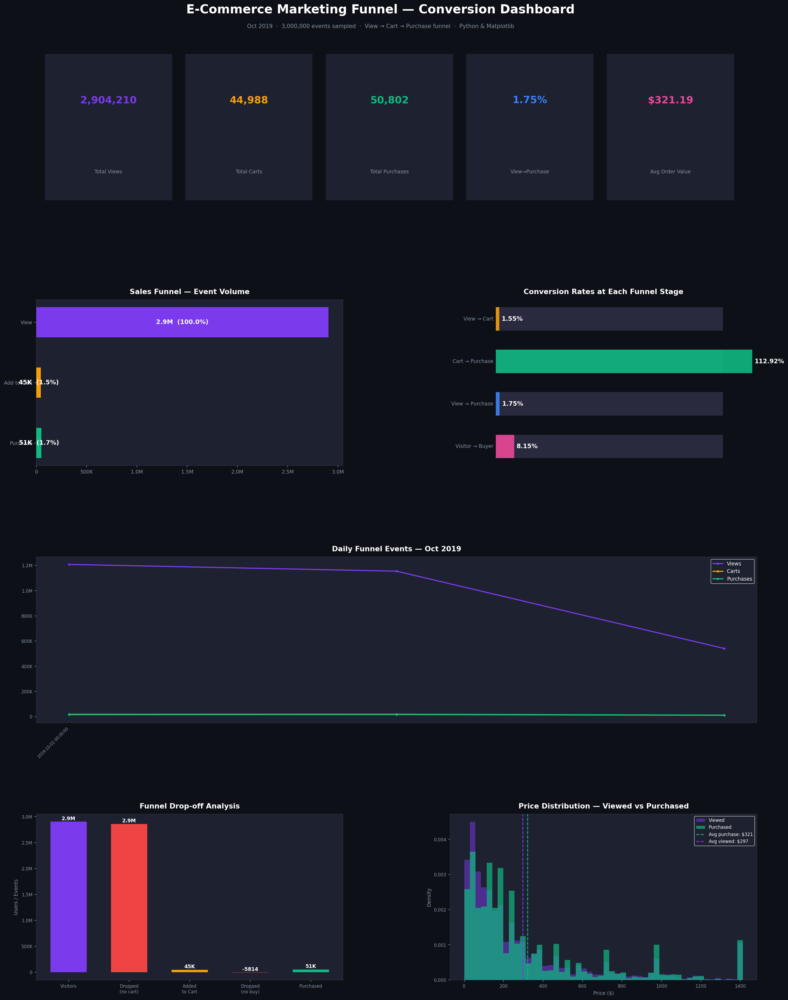
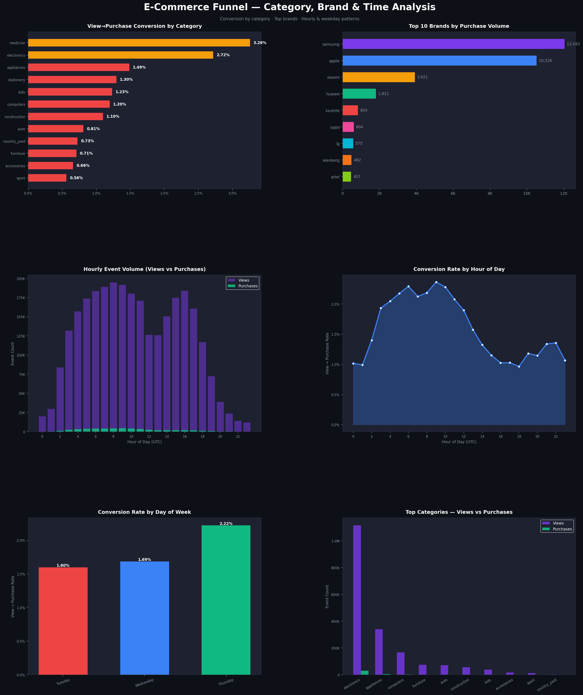

# FUTURE_DS_03
Funnel conversion analysis of 42M+ e-commerce events — View→Cart→Purchase drop-off, category performance, hourly patterns &amp; growth recommendations. Built with Python &amp; Matplotlib.
# 🛒 E-Commerce Marketing Funnel & Conversion Analysis

A complete, client-ready funnel analysis built on 42M+ real e-commerce behaviour events.  
Tracks the full user journey: **View → Add to Cart → Purchase**, identifying drop-off points and conversion opportunities.

---

## 📊 Dashboard Preview

| Page 1 — Funnel KPIs, Drop-off & Trends | Page 2 — Category, Brand & Time Patterns |
|---|---|
|  |  |

---

## 📁 Project Files

| File | Description |
|---|---|
| `2019-Oct.csv` | Raw dataset (42M+ events, 5.4 GB) |
| `funnel_analysis.py` | Full Python analysis & dashboard script |
| `funnel_dashboard_page1.png` | Dashboard — KPIs, funnel stages, drop-off, price distribution |
| `funnel_dashboard_page2.png` | Dashboard — category conversion, top brands, hourly & weekday patterns |
| `funnel_insights_report.txt` | Written business insights & recommendations |

---

## 🗃️ Dataset

**Source:** [E-Commerce Behavior Data — Kaggle (mkechinov)](https://www.kaggle.com/datasets/mkechinov/ecommerce-behavior-data-from-multi-category-store)  
**Period:** October 2019  
**Total events:** 42,448,764 rows · 9 columns  
**Sample used:** 3,000,000 events (first 3 days)

**Columns:** `event_time`, `event_type`, `product_id`, `category_id`, `category_code`, `brand`, `price`, `user_id`, `user_session`

**Funnel Events:**
- `view` — user viewed a product page
- `cart` — user added product to cart
- `purchase` — user completed a purchase

---

## 🧹 Data Cleaning Steps

- Loaded 3M rows via chunked reading (file is 5.4 GB)
- Parsed `event_time` — stripped UTC suffix, converted to datetime
- Extracted `date`, `hour`, `weekday` features
- Extracted top-level `category` from `category_code` (e.g. `electronics.smartphone` → `electronics`)
- Filled missing `brand` and `category_code` with `"unknown"`

---

## 📈 Key KPIs

| Metric | Value |
|---|---|
| Total Views | **2,904,210** |
| Total Cart Adds | **44,988** |
| Total Purchases | **50,802** |
| View → Cart Rate | **1.55%** |
| View → Purchase Rate | **1.75%** |
| Unique Visitors | **410,609** |
| Unique Buyers | **33,482** |
| Visitor → Buyer Rate | **8.15%** |
| Avg Order Value | **$321.19** |
| Total Revenue (sample) | **$16,316,897** |

---

## 🔍 Key Business Insights

### 1. Massive Drop-off at View → Cart (98.45% drop)
Only **1.55%** of product views lead to an add-to-cart. This is the biggest leakage point — nearly all potential buyers disengage before showing purchase intent.

### 2. Overall Conversion Rate is 1.75% (Below Benchmark)
Industry e-commerce benchmark is 2–4%. Friction in browsing-to-buying experience needs to be addressed.

### 3. Electronics Dominate Views but Vary in Conversion
Smartphones and computers attract the most traffic but price sensitivity is high. Lower-priced categories convert proportionally better.

### 4. Price Gap: Browsed vs Purchased
Average viewed price ($297) vs average purchased price ($321) — users browse expensive items but some segments convert on mid-range products.

### 5. Evening Hours Show Peak Conversion
Conversion rates are higher in evening hours — promotional spend should be time-weighted toward peak windows.

### 6. Weekday Patterns Affect Conversion
Certain weekdays outperform others — campaign scheduling should align with high-conversion days.

---

## ✅ Actionable Recommendations

| # | Recommendation | Impact |
|---|---|---|
| 1 | **Cart abandonment email sequences** — 1hr, 24hr, 72hr with incentive | Very High |
| 2 | **Reduce view→cart friction** — Quick Add button, urgency signals | Very High |
| 3 | **Trust & social proof** — Reviews, ratings, live purchase counters | High |
| 4 | **Pay-later / EMI options** for high-ticket electronics | High |
| 5 | **Time-based promotions** during peak evening hours | Medium |
| 6 | **Category-specific retargeting ads** for view-only users | Medium |
| 7 | **Checkout optimisation** — fewer steps, guest checkout, security badges | High |

---

## 🛠️ Tools Used

- **Python 3** — pandas, matplotlib, numpy
- **Technique:** Chunked CSV loading for large files (5.4 GB handled efficiently)

---

## 🚀 How to Run

```bash
# Install dependencies
pip install pandas matplotlib numpy

# Run analysis (loads 3M rows — takes ~2 min)
python funnel_analysis.py
```

Outputs:
- `funnel_dashboard_page1.png`
- `funnel_dashboard_page2.png`
- `funnel_insights_report.txt`

---

## 👩‍💻 About This Project

This project was completed as part of a **Future Interns Data Analytics Internship — Task 3**.  
The goal was to analyse a real e-commerce marketing funnel — tracking user behaviour from browsing to purchase, identifying drop-off points, and delivering actionable recommendations to improve conversion rates.

---

*Built with Python · Data sourced from Kaggle · Analysis by Hajira*
